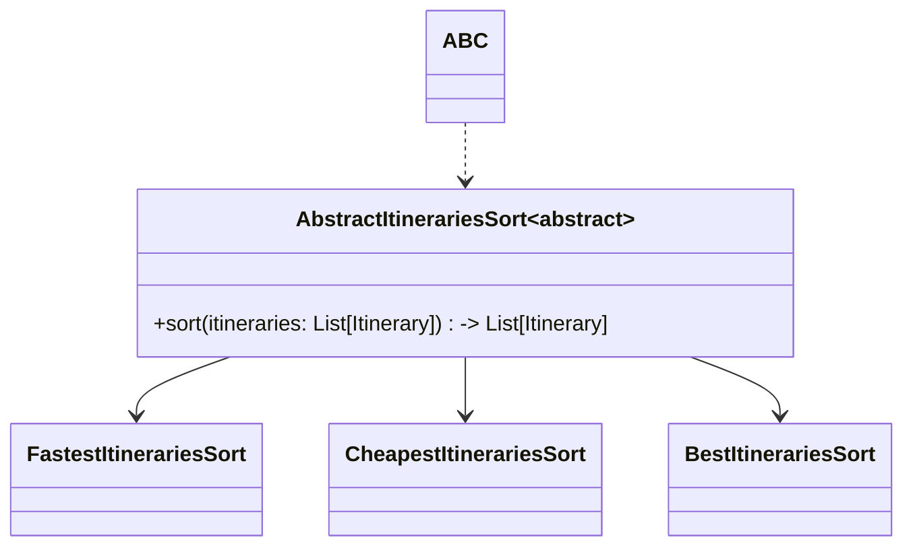
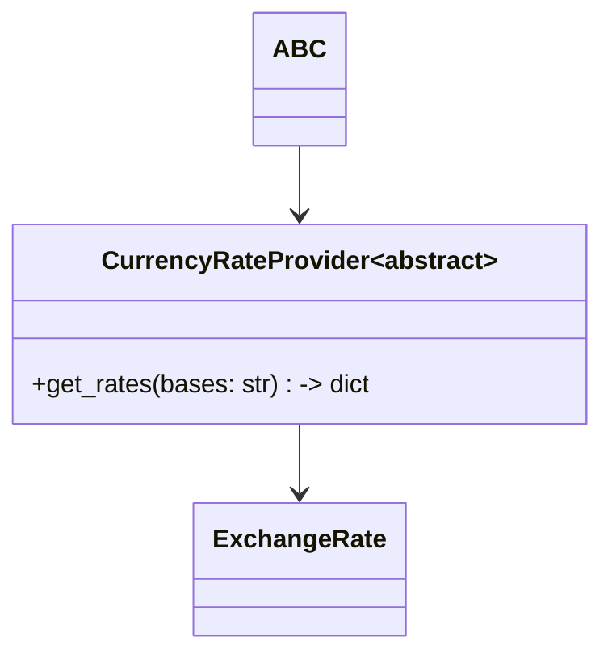

# KIWI Sort Itinerary API


___

<!-- TOC -->
* [KIWI Sort Itinerary API](#kiwi-sort-itinerary-api)
  * [Task definition](#task-definition)
  * [Run up the API](#run-up-the-api)
    * [With docker](#with-docker)
    * [With poetry](#with-poetry)
  * [Testing](#testing)
    * [Unit tests](#unit-tests)
    * [Integration tests](#integration-tests)
  * [Project structure](#project-structure)
  * [Technical details](#technical-details)
    * [API](#api)
      * [Routes](#routes)
      * [Sorting](#sorting)
      * [Fetching currency rates](#fetching-currency-rates)
    * [Proxy](#proxy)
  * [Continuous Integration](#continuous-integration)
  * [TODO](#todo)
    * [Why `Python3` and not `GoLang`?](#why-python3-and-not-golang)
<!-- TOC -->

## Task definition

Create an MVP API for sorting itineraries.  
For full task definition see [mcyprian/itineraries_sorting_task](https://github.com/mcyprian/itineraries_sorting_task)

## Run up the API

### With docker

```bash
docker compose up
```

### With poetry
To run api with poetry (this will run only asgi-application without a proxy), follow these steps:
```bash
cd app
set -a
source conf/.env
poetry run python3 src/app.py
```
`set -a && source .env` is needed to load environment variables from `.env` file and pass to a python process.
 
_Note: all poetry commands are run from the `app` directory._

## Testing

Testing is done with `unittest` and `testcontainers` libraries.
As sorting functionality is the core of the API, it is covered with tests on different levels.

```bash
❯ TESTCONTAINERS_API_IMAGE=5b90b076d4fc poetry run python3 -m unittest tests/**/test_*.py
Pulling image testcontainers/ryuk:0.8.1
Container started: f5aefbfbccb9
Waiting for container <Container: f5aefbfbccb9> with image testcontainers/ryuk:0.8.1 to be ready ...
Pulling image 5b90b076d4fc
Container started: dc811b408129
Pulling image nginx:alpine
Container started: 3e96432e1f09
Pulling image ghcr.io/smocker-dev/smocker
Container started: f32aaff662f4
....................................
----------------------------------------------------------------------
Ran 36 tests in 11.102s

OK
```

### Unit tests
Unit tests are located in `tests/unit` directory.
All tests are written with built-in `unittest` library, so no extra runner is needed.
Also for unit test would be enough to install main dependencies only (without `testcontainers`)

Testing of sort algorithm is done with permutations of itineraries and checking if the result is sorted correctly.
With subtests, there are more than 100 unit tests for sorting algorithm.
```
poetry run python3 -m unittest tests/unit/test_*.py
```

### Integration tests
Integration tests are located in `tests/integration` directory.  
These tests are using `testcontainers` library to run a real application with a proxy and test it with real requests.
For integration tests, it is needed to install all dependencies including `testcontainers`.  
_See [tool.poetry.group.tests.dependencies](./app/pyproject.toml)_

To run integration tests, you need to set the `TESTCONTAINERS_API_IMAGE` environment variable to the docker image of the API.

While running tests, there are spawned two more containers:
- `ruyk`: an internal container for the `testcontainers` library
- `smocker` - a container for mocking external services. Requests are passed through network alias.

Smoker is needed for two reasons:
- to reduce the number of requests to external services on testing stage.
- to make a test result deterministic, as `smoker` provides for tests always the same currency rates.

[_Smoker original repository_](https://github.com/smocker-dev/smocker) -- [_Documentation_](https://smocker.dev/docs/guide/intro)

```
TESTCONTAINERS_API_IMAGE=<image> poetry run python3 -m unittest tests/integration/test_*.py
```

## Project structure
```
.
├── README.md
├── app
│   ├── Dockerfile  # Dockerfile for application build
│   ...
│   ├── src         # application code
│   └── tests
│       ├── integration
│       └── unit
...
└── proxy           # proxy configuration. No Dockerfile, using nginx:alpine
    └── nginx.conf
```

## Technical details

### API

Api is built with `fastapi` framework and `uvicorn` as an ASGI server.
So that bring validation is done with `pydantic` library, which is quite slow;
and openAPI documentation is generated automatically.  
All pydantic `BaseModels` are located in `contracts` module.

A lot of documentation of the API is written in the code, and so I will not repeat it here.
I hope code is well-readable and self-explanatory.

Logging of the application is in `JSON` format and is printed to the console.
It is done to make it easier to parse logs with `ELK`(`EFK`) stack.

#### Routes

_I would like to add versioning of routing, but I did not to keep to the task requirements._

| Route               | Methods | Description                                                                  |
|---------------------|:--------|------------------------------------------------------------------------------|
| `/sorts`            | GET     | Returning available sorting algorithms that can be used to sort itineraries. |
| `/sort_itineraries` | POST    | Sorting itineraries by given algorithm                                       |
| `/healthz`          | GET     | Returning the health status of the service                                   |
| `/docs`             | GET     | OpenAPI documentation                                                        |


#### Sorting
Sort algorithms are registered in the runtime via metaclass to singleton.



_More about sort process you can find in the [source code -
sorts module](./app/src/sorts)_

#### Fetching currency rates

Currency rates are fetched from the external service `www.exchangerate-api.com`.
It is a free service without any authentication.

[ExchangeRate documentation](https://www.exchangerate-api.com/docs/free) -- [terms of use](https://www.exchangerate-api.com/terms)




More about sort process you can find in the [source code -
sorts module](./app/src/currency)

### Proxy

Proxy are using `nginx:alpine` image with a custom configuration.
The configuration is located in `proxy/nginx.conf` file.

Proxy is used to route requests to the API, do basic access control and cache responses from the backend.  
Nginx reverse proxy is passing requests to the API through the unix socket that should be mounted to the container
(or accessible from your local fs, if you want to run nginx bare-metal).

Task contained a requirement:
> Consider adding data storage and caching.

There was no specification about the type of caching.
On the proxy side, there are cached all 200 responses for 10 minutes, and 404 responses for 60m minute.
And it is important to note that HTTP POST requests are cached too, which is not a good practice in general.
But with the fact that the API is deterministic and idempotent, it is safe to cache POST requests.
Requests that are cached could be recognized by the `X-Cache` header.

Proxy passes only POST and GET requests.

## Continuous Integration

CI is primarily a testing application build and running tests only on pull requests.
There were no deployment requirements, and I have no resources to deploy on, so
there is no deployment stage in the CI pipeline.
This also means that there is no need for a separate CD pipeline.

This brings the problem with double build of docker image on `docker build` stage and `integration tests` stage.


## TODO
- [ ] advanced caching
  - [diskcache](https://pypi.org/project/diskcache/) (for processes synchronization)
  - [cachetools](https://pypi.org/project/cachetools/) (current solution alternative)
- [ ] add fuzz/performance tests
- [ ] nginx dynamic configuration
- [ ] distroless images
- [ ] CI should use docker hub.
- [ ] Metrics collection
- [ ] Independent process of fetch currency rates

### Why `Python3` and not `GoLang`?

`Python3` is my primary language, and I am more productive with it.  
However, (up to project plans) `GoLang` could be more suitable for the production solution.
